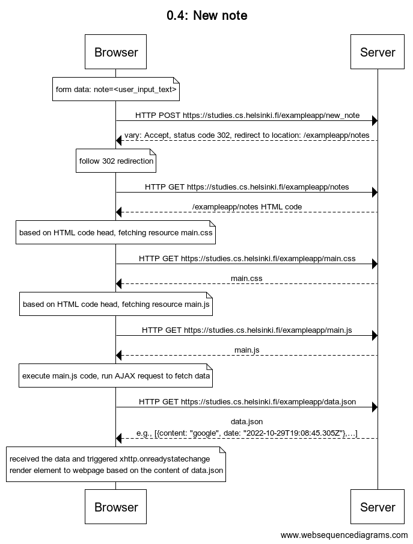

# 0.4: New note

#### The diagram shows as below:


#### source code
```
title 0.4: New note

note over Browser:
form data: note=<user_input_text>
end note
Browser->Server: HTTP POST https://studies.cs.helsinki.fi/exampleapp/new_note
Server-->Browser: vary: Accept, status code 302, redirect to location: /exampleapp/notes
note over Browser:
follow 302 redirection
end note
Browser->Server: HTTP GET https://studies.cs.helsinki.fi/exampleapp/notes
Server-->Browser: /exampleapp/notes HTML code
note over Browser:
based on HTML code head, fetching resource main.css
end note
Browser->Server: HTTP GET https://studies.cs.helsinki.fi/exampleapp/main.css
Server-->Browser: main.css
note over Browser:
based on HTML code head, fetching resource main.js
end note
Browser->Server: HTTP GET https://studies.cs.helsinki.fi/exampleapp/main.js
Server-->Browser: main.js
note over Browser:
execute main.js code, run AJAX request to fetch data
end note
Browser->Server: HTTP GET https://studies.cs.helsinki.fi/exampleapp/data.json
Server-->Browser: data.json\ne.g., [{content: "google", date: "2022-10-29T19:08:45.305Z"},…]
note over Browser:
received the data and triggered xhttp.onreadystatechange\nrender element to webpage based on the content of data.json
end note
```

